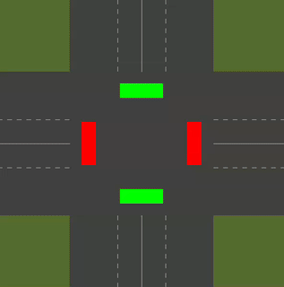

# Traffic Simulation Project

This project is a traffic simulation implemented in C using the SDL2 library. It simulates a four-way intersection with vehicles moving in different directions, traffic lights, and collision detection. The simulation is rendered using SDL2's rendering capabilities.

---

## Table of Contents
1. [Installation](#installation)
2. [Dependencies](#dependencies)
3. [Usage](#usage)
4. [Project Structure](#project-structure)
5. [References for SDL2](#references-for-sdl2)

---

## Installation

### Prerequisites
- A C compiler (e.g., `gcc` or `clang`)
- SDL2 library
- SDL2 development headers

### Steps
1. **Install SDL2**:
   - On Arch Linux:
     ```bash
     sudo pacman -S cmake sdl2-compact
     ```
   - On Windows:
     - Download the SDL2 development libraries from the [official SDL2 website](https://www.libsdl.org/download-2.0.php).
     - Follow the installation instructions provided.

2. **Clone the Repository**:
   ```bash
   git clone https://github.com/ManogyaDahal/dsa-queue-simulator
   cd dsa-queue-simulator
   ```

3. **Compile the Code**:
   ```bash
   cmake -S . -B build/
   ```

4. **Run the Simulation**:
   ```bash
   cd build && make

   #Run the simulator and generator in seperate terminal
   ./bin/Simulator
   ./bin/generator
   ```
   and run the simulator and generator

---

## Dependencies

- **SDL2**: Used for rendering the simulation and handling window management.
- **Standard C Libraries**: Used for basic I/O, memory management, and data structures.

---

## Usage

The simulation runs in a window and displays vehicles moving through a four-way intersection. Traffic lights control the flow of vehicles, and collision detection ensures vehicles do not overlap.

### Controls
- **Close the Window**: Click the close button or press `ESC` to exit the simulation.
- **Traffic Light Timing**: Traffic lights switch automatically every 8.555 seconds.

---

## Project Structure

- **`generator.c`**: Program for generating traffic by choosing a random lane.
- **`simulator.c`**: Program for simulating the traffic by drawing and rendering.
- **`README.md`**: This file, providing an overview of the project.
- **`cmake`**: To simplify the the process to build make file
- **`Makefile`**: A Makefile to simplify the build process.

### Key Components
1. **Vehicle Management**:
   - Vehicles are represented by the `Vehicle` struct.
   - A `VehicleQueue` is used to manage vehicles waiting to enter the simulation.

2. **Traffic Light Management**:
   - Traffic lights are controlled by the `updateTrafficLights` function.
   - Lights switch between green and red states at regular intervals.

3. **Rendering**:
   - SDL2 is used to render vehicles, roads, and traffic lights.
   - The `DrawBackground` function draws the roads and lane markings.
   - The `drawVehicle` function renders each vehicle on the screen.

4. **Lane Checks for Traffic State**:
   - Vehicles stop if the traffic light is red.
   - Vehicles if they aren't prioritized at an instance.

---

## References for SDL2

- **Official SDL2 Documentation**: [https://wiki.libsdl.org/](https://wiki.libsdl.org/)
- **SDL2 Tutorials**: [Lazy Foo' SDL Tutorials](https://lazyfoo.net/tutorials/SDL/)
- **SDL2 GitHub Repository**: [https://github.com/libsdl-org/SDL](https://github.com/libsdl-org/SDL)

---
## DEMO:


